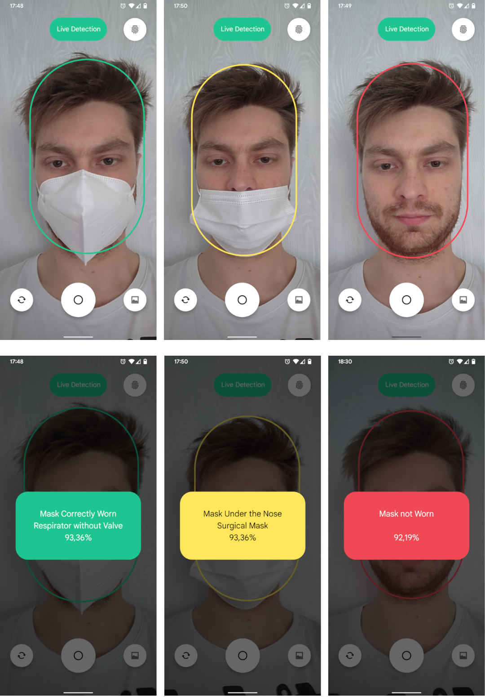

# Covid Protection Checker
## Main application
### Description
An Android 11+ application which can detect and classify the types and the main ways that masks/respirators are worn by people according to the [`WWMR-DB dataset`](https://ieee-dataport.org/open-access/ways-wear-mask-or-respirator-wwmr-db).

The detected ways of wearing masks/respirators are:
- `mask/respirator correctly worn`
- `mask/respirator not worn`
- `mask/respirator hanging from an ear`
- `mask/respirator on the tip of the nose`
- `mask/respirator on the forhead`
- `mask/respirator under the nose`
- `mask/respirator over the chin`
- `mask/respirator under the chin`

The detected types of masks/respirators are:
- `non-medical mask`
- `surgical mask`
- `respirator with valve`
- `respirator without valve`

---

### Main features
The application offer two main features: 
- `live detection` available in the `MainActivity`
- `advanced analysis` available in the `AnalyzeActivity`

---

### Live Detection
The `live detection` feature uses the `CameraX` API to capture and analyze the frames acquired by the smartphone camera in real time.  
The CameraX API also allows the user to switch between the front and rear cameras, to `tap-to-focus` and to `pinch-to-zoom` on the camera preview.  
In this case, the detection is done by using a custom trained convolutional neural network based upon the `EfficientDet-Lite 0` spec.  

Once live-detected, a face correctly/incorrectly wearing a mask/respirator will be surrounded by an oval (rounded rectangle) that can have 3 possible colors:
- `green` if the mask/respirator is correctly worn
- `yellow` if the mask/respirator is worn incorrectly
- `red` if the mask/respirator is not worn at all

For instance:   

---

### Advanced analysis
The `advanced analysis` feature relies on another custom trained convolution neural network, but insted of being based upon the fast and lightweight spec of the `live detection` feature, it uses the `EfficientDet-Lite 4` spec as the underlaying basis.  
This choice allow for more accurate detections at the cost of a lower framerate (30fps of the live detection vs 4fps of the advanced analysis).

An example of the advanced analysis:   

--- 

## Application extension
### Description
Based upon the work done on the main application, this expansion allows the application to know if two people are respecting the social distance of 1m required by the Covid-19 restrictions.

---

### How it works
The underlaying method is based upon 3 main steps:
- understanding which person is the furthest and which one's the closest by the mean of a depth-map obtained thanks to the [`MiDas`](https://github.com/isl-org/MiDaS) neural network
- using the proportions of the human face to understand at which distance each person is at
- correcting the distortion of the measurements due to the distances between the people and the observer (smartphone)

These are some of the obtained results:   

---

### Limitations of the method
This way of calculating the distance between two people is ineffective whenever the focal length of the smartphone camera differs from the ones used during testing.  
This method also don't take into consideration that men and women have slightly different face proportions and so the measurements between two women may have a different measurement error if compared to the distance calculated between two men. The same reasoning applies to young people.  
Also the `MiDas` neural network is not perfect and may yield some inconsistent depth-map which may interfere with the distances calculations. 

---

### Resources
The PDF paper of this work is available at: [`./githubResources/Relazione Sistemi Digitali M.pdf`](https://github.com/CristianDavideConte/SistemiDigitali/blob/main/githubResources/Relazione%20Sistemi%20Digitali%20M.pdf)  
The Power Point presentation of this work is available at: [`./githubResources/Presentazione Sistemi Digitali M.pptx`](https://github.com/CristianDavideConte/SistemiDigitali/blob/main/githubResources/Presentazione%20Sistemi%20Digitali%20M.pptx)  
The PDF presentation of this work is available at: [`./githubResources/Presentazione Sistemi Digitali M.pdf`](https://github.com/CristianDavideConte/SistemiDigitali/blob/main/githubResources/Presentazione%20Sistemi%20Digitali%20M.pdf)  
The dataset used for training the NN of this work is available at: [`IEEEDataPort`](https://ieee-dataport.org/open-access/ways-wear-mask-or-respirator-wwmr-db)  
The Google Colab training file of this work is available at: [`./githubResources/TrainingAI-SisDig.ipynb`](https://github.com/CristianDavideConte/SistemiDigitali/blob/main/githubResources/TrainingAI-SisDig.ipynb)  

Click [`here`](https://github.com/CristianDavideConte/SistemiDigitali/releases/download/1.0.0/Covid.Protection.Checker.apk) to download the apk file of this application. 

---

## Authors
Cristian Davide Conte  
Simone Morelli
